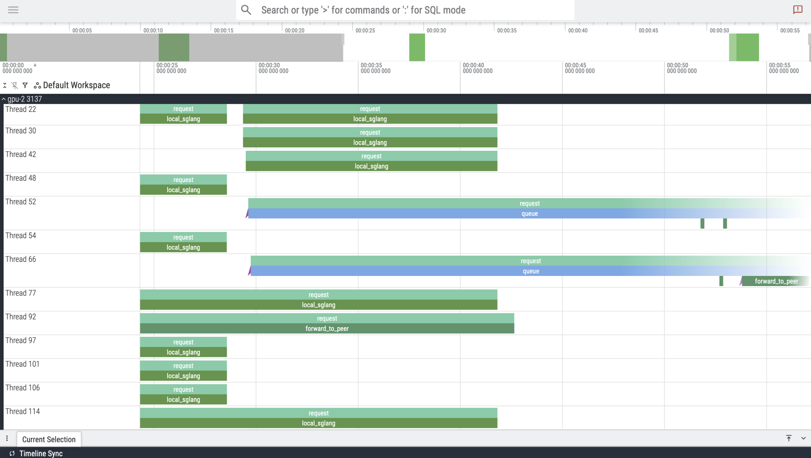

# GORGO

Maximizing KV-Cache Reuse While Minimizing Network Latency in Cross-Region LLM Load Balancing.

## Python Environment Setup

Create a Python virtual environment in the benchmark directory:

```bash
cd benchmark
python3 -m venv .venv
source .venv/bin/activate
pip install -r requirements.txt
cd ..
```

## Setup for Research Replication/Experimentation
1. [Install golang](https://go.dev/doc/install)
2. Clone this repo
3. Build gotoni from source
```bash
go build -o gotoni
```
4. Setup an account on [Lambda.ai](https://lambda.ai) and run:
```bash
export LAMBDA_API_KEY=your_token_here
```
> Email [atoniolo76@gmail.com](mailto:atoniolo76@gmail.com) to get a Lambda.ai API key for testing
5. Run `gotoni available` to see available Lambda instances and `gotoni launch` to check out instances
- Note: Instances from at least three separate regions are required for Gorgo's TTFT improvement (or two if running GORGO-proxy)
6. Run `gotoni cluster setup`, which handles sglang installation, mistral-7b download, and the gotoni binary deployment for load balancer processes. Uses all currently running Lambda.ai instances on your account.

## Benchmarking Routing Policies

The repository includes preprocessed WildChat datasets:
- `benchmark/wildchat_guidellm.jsonl` - 8,893 prompts with location mappings
- `benchmark/wildchat_location_lookup.json` - 8,117 unique location entries

### Step 1: Run Benchmarks

**Available profiles**: `poisson`, `sweep`, `constant`, `concurrent`, `throughput`

Start the geo-routing proxy and run GuideLLM benchmarks:

```bash
# Start geo-routing proxy (routes by user location from WildChat)
cd benchmark
python geo_proxy.py --port 9000 &
cd ..

# Run GuideLLM benchmark
guidellm benchmark \
  --target http://localhost:9000/v1 \
  --profile poisson \
  --rate 5 \
  --max-seconds 60 \
  --data ./benchmark/wildchat_guidellm.jsonl \
  --data-column-mapper '{"text_column": "prompt"}'
```

Results, including metrics like TTFT and Throughput, are saved to `guidellm_results/`.

**Note #1**: Update cluster node IPs in `geo_proxy.py` (lines 40-44) to match your deployment.

**Note #2**: Between benchmarks, run `gotoni cluster flush-cache` to clear both KV-caches and LB prefix trees, otherwise prefix-tree and GORGO will behave like least-load.

#### Other options

Switch between routing strategies (gorgo, prefix-tree, least-load):

```bash
gotoni cluster restart-lb --strategy prefix-tree --max-concurrent 50
```

`--max-concurrent` sets the maximum requests forwarded per instance (higher = more parallelism, lower = stricter queueing).

Create traces of per-gpu request queueing/forwarding/processing. Before benchmarking, start the tracing service with:

```bash
./gotoni cluster stop-trace
```
Once benchmark is complete: 
```bash
./gotoni cluster stop-trace
```

View in [perfetto.dev](https://perfetto.dev):




#### Tuning GORGO Parameters

Fine-tune GORGO's cost calculation by editing `pkg/config/constants.go`:

1. **`DefaultGORGORunningCostFactor`** ($\hat{q}_s$ in paper) - Weight for running requests' prefill cost (default: 0.5)
   - Lower = running requests weighted less in cost calculation

2. **`DefaultGORGOMsPerToken`** ($t_p$ in paper) - Prefill time per token in ms (default: 0.094)
   - Measured cold-start prefill rate on your hardware

3. **`DefaultSGLangMaxRunningRequests`** - Max concurrent requests per SGLang instance (default: 10)
   - Controls when requests queue (triggering the routing policy)

After changes, rebuild and redeploy: `go build -o gotoni && gotoni cluster upload && gotoni cluster restart-lb`

### Step 2: Analyze Benchmark Results

After benchmarking completes, results are saved to `guidellm_results/` (benchmark metrics). Run:  

View the per-gpu trace in `benchmark_results/`.

#### Important Metrics

- **Time to First Token (TTFT)**: First token generation latency (lower is better)
- **Throughput**: Requests completed per second
- **Average Latency**: Total request latency across all nodes

## GORGO Centralized Proxy

The centralized proxy (`gotoni proxy`) routes requests using GORGO with queue + running request tracking for ALL instances and not just the local server.

```bash
# Deploy proxy to a cloud instance
gotoni proxy deploy west_2 --listen-port 9000
gotoni proxy --remote west_2 status

# Manage servers
gotoni proxy --remote west_2 clear-cache # clears *mirrored* prefix tree, not actual KV-cache on instances

# Benchmark through proxy (replace IP with your instance's IP)
guidellm benchmark --target http://146.235.219.131:9000/v1 --profile poisson --rate 5 --max-seconds 60
```

Running this benchmark without the geo_proxy.py will send all requests to the proxy, which will then run the GORGO forwarding policy (cache + latency aware).
