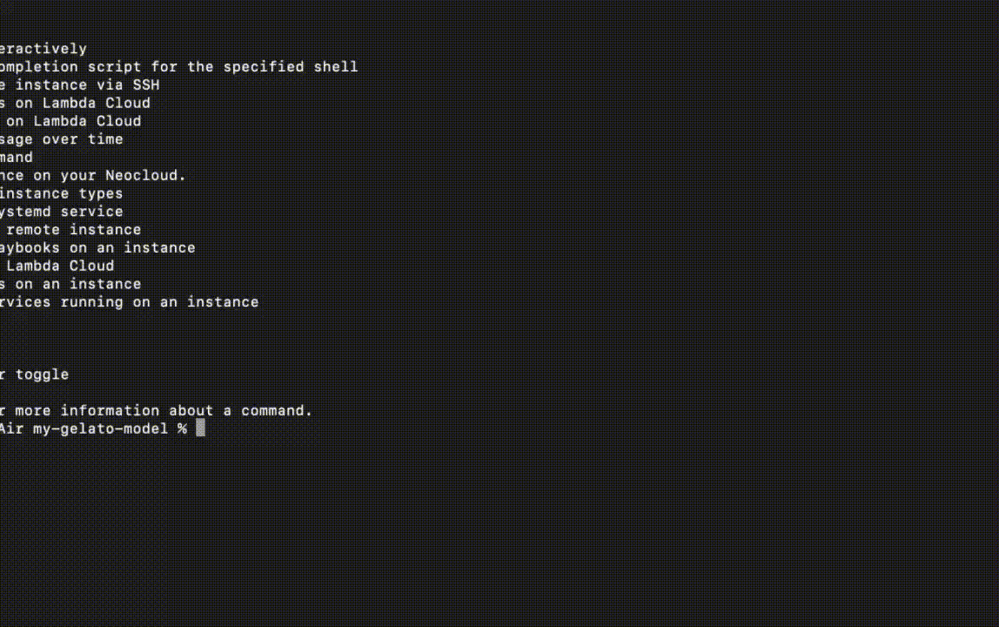
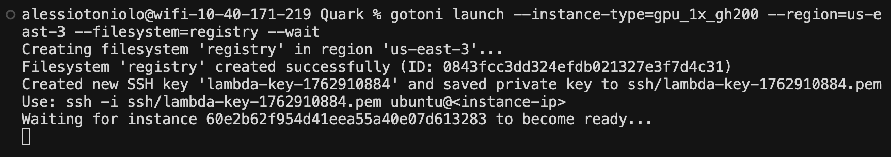

# gotoni



Automate Lambda.ai with Ansible-inspired Go CLI  

## Motivation
On-demand GPUs are powerful for experimenting with new models and hosting your own inference.

Thankfully, the team at [Lambda.ai](https://lambda.ai) have created an excellent [API](./docs/Lambda%20Cloud%20API%20spec%201.8.3.json) for spinning up instances, managing filesystems, and even replacing inbound firewall rules on the fly!

gotoni aims to make deploying your own infra process simple and automated through a CLI. I prefer this over a GUI or manual YAML configuration because AI agents are quite adept at using the terminal, so managing your infra without even needing a remote SSH window makes things 10x faster!

## How it works
Like [Ansible Automation](https://docs.ansible.com/projects/ansible/latest/playbook_guide/index.html), you can create a "playbook" by adding setup tasks with YAML property `type: command`. Tasks you want to run continuously in the background, like an OpenAI inference server for example, are labeled "service" and managed by systemd. Telemetry is available with the `logs` cmd.

## Installation

```bash
curl -fsSL https://raw.githubusercontent.com/atoniolo76/gotoni/main/install.sh | bash
```

## Setup

Export your [Lambda API key](https://cloud.lambda.ai/api-keys/cloud-api):

```bash
export LAMBDA_API_KEY=your_token_here
```
## Launch an instance
Here's an example of launching your first instance, specifying the `--instance-type`, `--region`, `--filesystem`, and `--wait` flags.<br>


## Commands

- `gotoni launch` - Launch a new instance
- `gotoni list [--running]` - List instances or instance types
- `gotoni delete <instance-id>` - Terminate instances
- `gotoni connect <instance-ip>` - Connect to an instance via SSH
- `gotoni run [instance-id] <command>` - Run a command on a remote instance
- `gotoni setup [instance-id]` - Run setup tasks/playbooks
- `gotoni start [instance-id]` - Start service tasks
- `gotoni status [instance-id]` - Check status of services
- `gotoni logs [instance-id] [service-name]` - View service logs
- `gotoni gpu [instance-id] --log <file.csv>` - Track GPU memory usage
- `gotoni ssh-keys list` - List SSH keys
- `gotoni ssh-keys delete <key-id>` - Delete an SSH key
- `gotoni filesystems list` - List filesystems
- `gotoni filesystems delete <filesystem-id>` - Delete a filesystem

## Configuration

Configuration is stored in `~/.gotoni/config.yaml` and is automatically managed. The file contains:

- `instances`: Mapping of instance IDs to SSH key names
- `ssh_keys`: Mapping of SSH key names to private key file paths
- `filesystems`: Mapping of filesystem names to filesystem info (ID and region)
- `tasks`: List of tasks to run on instances. Use `depends_on` and a previous task name to enforce successful command execution in order.

Example `config.yaml`:

```yaml
instances:
  instance-123: lambda-key-1234567890

ssh_keys:
  lambda-key-1234567890: ssh/lambda-key-1234567890.pem

filesystems:
  my-data:
    id: fs-123
    region: us-east-1

tasks:
  - name: "Install dependencies"
    type: "command"
    command: "sudo apt-get update"
  
  - name: "Start server"
    type: "service"
    command: "python app.py"
    depends_on:
      - Install dependencies
```

## TODO (PRs welcome!)
- [ ] Create client struct for sdk usage
