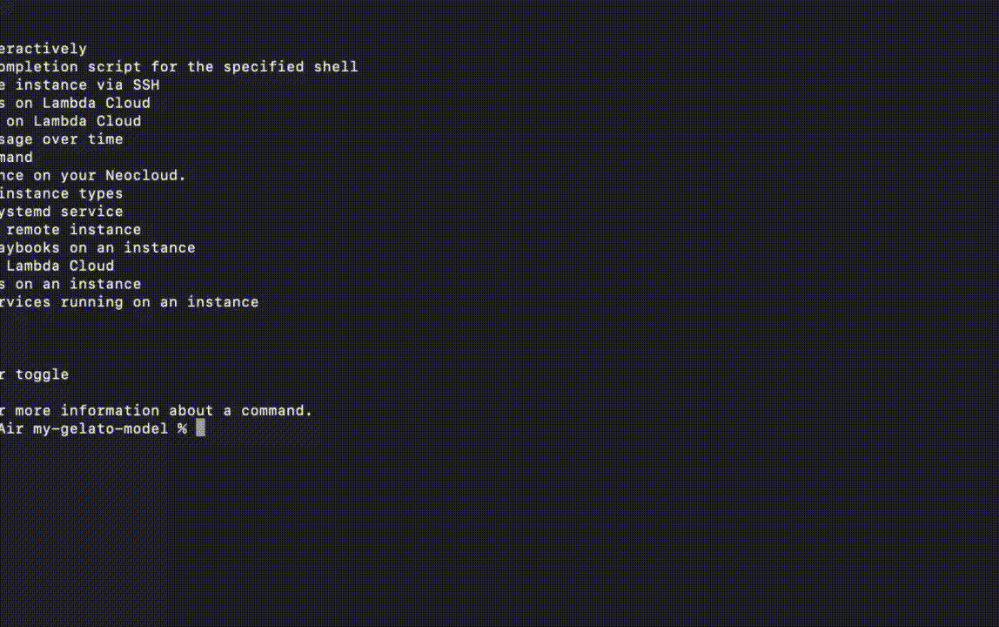

# gotoni



gotoni lets you manage, share, and interact with your GPUs over SSH.

## Installation

```bash
curl -fsSL https://raw.githubusercontent.com/atoniolo76/gotoni/main/install.sh | bash
```

## Setup

Export your cloud's API key:

```bash
# Lambda.ai
export LAMBDA_API_KEY=xxx
# Modal
export MODAL_TOKEN_ID=your_token_id
export MODAL_TOKEN_SECRET=your_token_secret
# Orgo
export ORGO_API_KEY=your_token_here
```

## Workflow

### 1. Launch an Instance

Launch an instance and `--wait` until the instance is ready.

```bash
gotoni launch my-project \
  -t gpu_1x_a10 \
  --filesystem my-data \
  --wait
```

### 2. Open in IDE

Once launched, instantly open the remote workspace in your preferred IDE (defaults to Cursor).

> **Prerequisite:** Ensure you have installed the command-line tool for your IDE.
> - **Cursor:** `Cmd+Shift+P` > "Install 'cursor' command"
> - **VS Code:** `Cmd+Shift+P` > "Install 'code' command"

**Cursor:**

```bash
gotoni open my-project --cursor
```

**VS Code:**

```bash
gotoni open my-project --code
```

### 3. Share Access Securely

Grants SSH capability to your project partner or research buddy.

**Sender:**
```bash
export GOTONI_CLOUD=modal
gotoni share              # auto-picks first running sandbox
gotoni share sb-abc123    # specific sandbox ID
```

**Receiver:**
```bash
gotoni receive <wormhole-code>
# Automatically configures: ssh modal-sb-abc12345
```

## Add Tasks on creation

Create tasks that will be executed during instance launch. You can also specify services to run in the background like an inference server.

### Example: Install vLLM and Serve Kimi-K2-Thinking 

```bash
gotoni tasks add --name "install vllm" --command "sudo apt install -y python3-pip && pip install vllm"
gotoni tasks add --name "run kimi" --command "vllm serve moonshotai/Kimi-K2-Thinking" --depends-on "install dependencies" --type service
```

### Launch with Tasks

```bash
gotoni launch ml-instance
  -t gpu_1x_a100
  -r us-west-1
  --wait
  --tasks "install vllm,run kimi"
```

## Commands Reference

- `gotoni launch` - Launch instances (supports waiting, filesystems, and tasks)
- `gotoni open` - Open remote instance in Cursor/VS Code
- `gotoni share` - Securely share SSH access
- `gotoni receive` - Receive SSH access and auto-configure
- `gotoni tasks` - Manage automation tasks
- `gotoni provision` - Run tasks on an existing instance
- `gotoni list` - List active instances
- `gotoni available` - List available instance types and regions
- `gotoni run` - Execute remote commands
- `gotoni delete` - Terminate instances
- `gotoni filesystems` - Manage filesystems
- `gotoni ssh-keys` - Manage SSH keys
